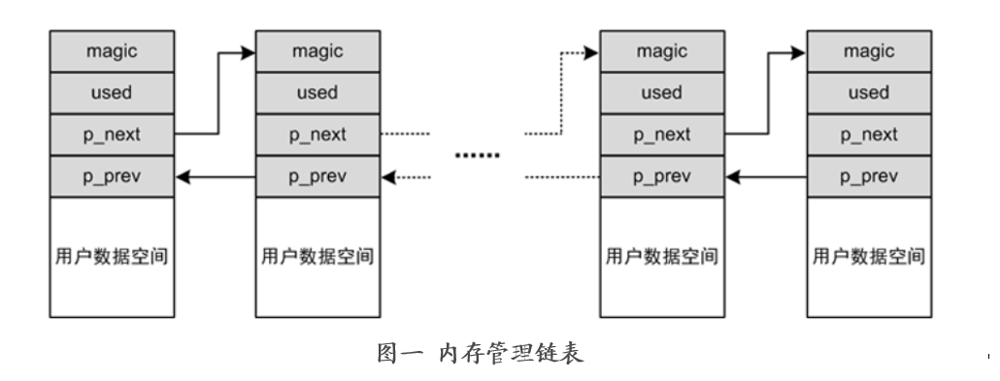

一、介绍
<br />&emsp;&emsp;堆是在程序运行时动态分配的内存，一般由程序员分配释放， 若程序员不释放，程序结束时可能由OS回收 。如在程序中，用malloc, calloc, realloc等分配内存的函数分配得到的就是在堆上。
<br />&emsp;&emsp;堆内存的特点：
<br />&emsp;&emsp;1、地址生长方向由低到高。
<br />&emsp;&emsp;2、堆实现内存按需分配。内存分配不是根据地址先后顺序，而是由申请的内存大小决定；同时，使用时申请并分配，使用完毕时释放归还。
<br />&emsp;&emsp;3、以链表结构进行管理。由于内存分配往往按页（4K）来分配，而堆进行分配的对象往往都比较小。为了减小系统开销，堆的内存使用会先申请一块较大的内存区域，并根据使用对象的大小、用户需求划分成许多小块地址空间，同时以链表的形式将这些分散的内存区域统一管理起来。用户申请时根据申请对象大小在其中的空闲链表中查找最适合的（根据分配策略）进行分配。

<br />二、堆的安全问题
<br />&emsp;&emsp;堆所面临的威胁主要是针对堆的缓冲区溢出攻击，也称为堆溢出（heap overflow）。在系统中，大约有一半的安全信息泄漏都是来源于堆溢出，因为堆内存中的对象存有函数指针、安全相关的变量等。它们会对程序的执行产生影响，会改变程序的行为与跳转等，如条件判断的时候分支跳转、函数指针的执行跳转等，攻击者需要对它们进行攻击来达到控制程序的目的。
<br />&emsp;&emsp;堆的安全威胁来自于固有的机制，这些来自于内存管理中存在的漏洞。
<br />&emsp;&emsp;1、堆的链式管理。
<br />&emsp;&emsp;在堆的链表中，通过前向指针（p_prev）和后向指针（p_next）将所有对象连接起来，这是一个双向链表。这样带来的问题就是其中一个指针泄漏，就会导致整个堆所管理的对象的地址都泄漏，攻击者只要获取某链表指针，然后推测出每一个对象的结构布局，便可以通过链表指针和对象中某变量数据的偏移量进行任意访问；同时，在空闲链表的管理中，这些对象在内存中是连续的，攻击者很容易掌握这些待分配的对象的结构布局，从而进行有针对性的攻击，这些都是十分危险的。
<br />&emsp;&emsp;2、分配与释放
<br />&emsp;&emsp;堆的分配时，在空闲链表中找到一个大小合适的对象进行分配，然后更新相应的空闲链表和使用链表。在使用完毕释放时，并没有将内存数据清除，而是直接将其从使用链表中移除，放入空闲链表中，待下次重新分配。其中对分配的内存的操作都是在分配完之后由程序根据需要进行，这便将之前的数据暴露给了之后的使用者。这也是由于堆的初衷所导致的，为了减小开销，提高分配效率，直接将原来分配好放入缓冲区，需要的时候直接拿过来用。
<br />三、安全措施
<br />&emsp;&emsp;1、空闲链表随机化
<br />&emsp;&emsp;为了解决空闲链表连续性的问题，在申请整块较大的内存后，对该内存空间进行切分并创建链表管理时，将空闲链表在创建的时候进行随机排列，然后再由链表连接起来，这样消除了链表顺序与地址空间连续性之间的联系。
```
static void freelist_randomize(struct rnd_state *state, unsigned int *list,unsigned int count)
{
    unsigned int rand;
    unsigned int i;

    for (i = 0; i < count; i++)
        list[i] = i;

    for (i = count - 1; i > 0; i--) {
        rand = prandom_u32_state(state);
        rand %= (i + 1);
        swap(list[i], list[rand]);
    }
}
```
<br />&emsp;&emsp;2、链表指针地址加密
<br />&emsp;&emsp;链表的前向指针和后向指针位于堆分配对象的首尾部，位置固定且重要，为此通过加密该指针，至少使其在内存中不是以明码的方式存在，防止整个链表进一步泄漏。如slub空闲链表指针进行了简单的异或处理，存入时异或运算加密，取出时再一次异或解密恢复即可使用，其中依赖于产生的一个随机数强化加密效果。虽然安全措施较为简单、强度不是很高，但简单的运算效率高、引入的系统开销少，且能够一定程度减缓安全威胁。
```
static inline void *freelist_dereference(const struct kmem_cache *s,void *ptr_addr)
{
	return freelist_ptr(s, (void *)*(unsigned long *)(ptr_addr),  (unsigned long)ptr_addr);
}

```
```
static inline void *freelist_ptr(const struct kmem_cache *s, void *ptr,unsigned long ptr_addr)
{
#ifdef CONFIG_SLAB_FREELIST_HARDENED
	return (void *)((unsigned long)ptr ^ s->random ^ ptr_addr);
#else
	return ptr;
#endif
}
```
<br />3、边界检测
<br />&emsp;&emsp;为了防止一个堆对象操作影响到相邻的对象，需要在写入操作时进行边界检测，防止溢出而覆写到不应该触及的位置。如PAX_USERCOPY中包含了堆的边界检测，在内核和用户空间数据交互时对堆的边界进行检测，判断地址所在也是否在slab中，并且是否存在跨页的情况等，以此防止溢出或越界。
```
static inline void check_heap_object(const void *ptr, unsigned long n,bool to_user)
{
    struct page *page;

    if (!virt_addr_valid(ptr))
        return;
	
    page = virt_to_head_page(ptr);

    if (PageSlab(page)) {
        /* Check slab allocator for flags and size. */
        __check_heap_object(ptr, n, page, to_user);
    } else {
        /* Verify object does not incorrectly span multiple pages. */
        check_page_span(ptr, n, page, to_user);
    }
}
```
4、释放清空
<br />&emsp;&emsp;在对于堆内存的释放回收时，根据需要将该回收对象清零。这个操作是会带来额外的开销，所以并不是所有的释放都要进行清零。而是根据对象的数据敏感程度、安全策略、控制信息等来决定。
```
void ___cache_free(struct kmem_cache *cachep, void *objp,unsigned long caller)
{
  …
    if (unlikely(slab_want_init_on_free(cachep)))
        memset(objp, 0, cachep->object_size);	 /*释放后将内存清*/
  …

}
```

